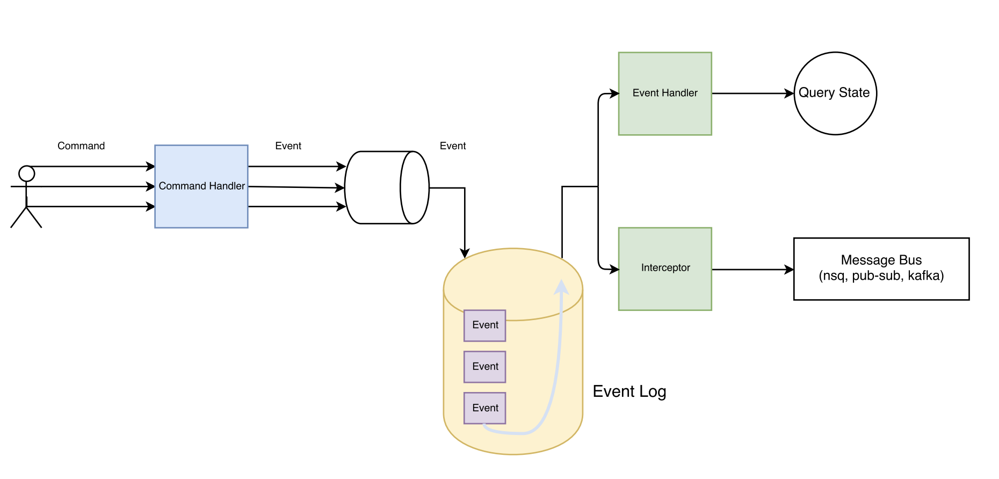

## kcqrs

CQRS library build in Kotlin for better development experience.

### Build Status
[](https://travis-ci.org/clouway/kcqrs)

### Architecture


### Use Case

```kotlin
class Invoice private constructor(@JvmField var customerName: String, @JvmField val amount: BigDecimal) : AggregateRootBase() {

  // Required for the serialization 
  constructor() : this("", BigDecimal.ZERO)

  constructor(id: UUID, customerName: String, amount: BigDecimal) : this(customerName, amount) {
    applyChange(InvoiceCreatedEvent(id, customerName))
  }

  fun changeCustomerName(customerName: String) {
    applyChange(InvoiceCustomerNameChangedEvent(getId()!!, customerName))
  }

  fun apply(event: InvoiceCreatedEvent) {
    uuid = event.invoiceId
    customerName = event.customerName    
  }

  fun apply(event: InvoiceCustomerNameChangedEvent) {
    customerName = event.newCustomerName
  }
}
    
data class InvoiceCreatedEvent(@JvmField val invoiceId: UUID, @JvmField val customerName: String) : Event
    
data class InvoiceCustomerNameChangedEvent(@JvmField val invoiceId: UUID, @JvmField val newCustomerName: String) : Event

// ...
// Usage 
val invoice = Invoice(UUID.randomUUID(), "John", BigDecimal(30))        
eventRepository.save(invoice)

invoice.changeCustomerName("Peter")
eventRepository.save(invoice)

// Load Invoice document from events
val updateInvoice = eventRepository.getById(invoice.getId()!!, Invoice::class.java)
```

#### Handling Commands 

```kotlin
val messageBus = cqrs.messageBus()

// On App Initialization 
messageBus.registerCommandHandler(ChangeCustomerName::class.java, ChangeCustomerNameHandler())

// Dispatch User Action in Servlet or REST Api Call 
fun registerNewCustomer(req: HttpServletRequest, HttpServletResponse) {     
  msgBus.send(RegisterNewCustomer(req.getParameter("name")))      
} 

```

#### Handling Events 

```kotlin

val messageBus = cqrs.messageBus()

// On App Initialization 
msgBus.registerEventHandler(CustomerRegisteredEvent::class.java, CustomerRegisteredEventHandler(InMemoryCustomerRepository()))

// Handle registration event      
msgBus.handle(CustomerRegisteredEvent("Any Customer Name"))       

```
#### Interceptors
Interceptors are a powerful mechanism that can monitor, rewrite, and retry calls. Here's a simple interceptor that
publishes received event. 

```kotlin

val msgBus = cqrs.messageBus()
val pubSubPublisher = object : Interceptor {
   override fun intercept(chain: Interceptor.Chain) {     
     // make sure that event is processed by other handlers                                 
     chain.proceed(chain.event())
     
     val pubSubEvent = adapt(chain.event())     
     pubSubPublisher.publish(pubSubEvent)
  }
}
msgBus.registerInterceptor(pubSubPublisher)

// ....
msgBus.handle(event)                

```

#### App Engine Adapter

Registering Event Handler
```kotlin
class KCqrsEventHandler : AbstractEventHandlerServlet() {
    private val gson = Gson()

    override fun decode(inputStream: InputStream, type: Class<*>): Event {
        val event = gson.fromJson(InputStreamReader(inputStream, "UTF-8"), type)
        return event as Event
    }

    override fun messageBus(): MessageBus {
        return CQRSContext.messageBus()
    }
    
}
```

Adding it to web.xml
```xml
  <servlet>
    <servlet-name>kcqrsEventHandler</servlet-name>
    <servlet-class>com.clouway.kcqrs.example.KCqrsEventHandler</servlet-class>
  </servlet>

  <servlet-mapping>
    <servlet-name>kcqrsEventHandler</servlet-name>
    <url-pattern>/worker/kcqrs</url-pattern>
  </servlet-mapping>

  <security-constraint>
    <web-resource-collection>
      <web-resource-name>worker</web-resource-name>
      <url-pattern>/worker/*</url-pattern>
    </web-resource-collection>
    <auth-constraint>
      <role-name>admin</role-name>
    </auth-constraint>
  </security-constraint>
```

```kotlin
// Initialize KCQRS for GAE
private var cqrs = AppEngineKcqrs.Builder(configuration, messageFormatFactory).build {
    kind = "Event"
    kcqrsHandlerEndpoint = "/worker/kcqrs"
    identityProvider = IdentityProvider.Default()
    requestInitializer = HttpRequestInitializer { 
        it.headers.setAuthorization("Bearer ${securityProvider.getAuthorizationToken()}")
    }
} 

// Accessing message bus
cqrs.messageBus()
// Accessing repository 
cqrs.repository()
```


#### Maven dependency 

```xml  
    <dependency>
      <groupId>com.clouway.kcqrs</groupId>
      <artifactId>kcqrs-core</artifactId>
      <version>0.0.1</version>
    </dependency>
    
   <dependency>
      <groupId>com.clouway.kcqrs.adapters</groupId>
      <artifactId>kcqrs-appengine</artifactId>
      <version>0.0.1</version>
    </dependency>
```


#### TODO
 * MongoDB Adapter 
 
### License
Copyright 2019 clouWay ood.

Licensed under the Apache License, Version 2.0 (the "License");
you may not use this file except in compliance with the License.
You may obtain a copy of the License at

   https://www.apache.org/licenses/LICENSE-2.0

   Unless required by applicable law or agreed to in writing, software
   distributed under the License is distributed on an "AS IS" BASIS,
   WITHOUT WARRANTIES OR CONDITIONS OF ANY KIND, either express or implied.
   See the License for the specific language governing permissions and
   limitations under the License.
